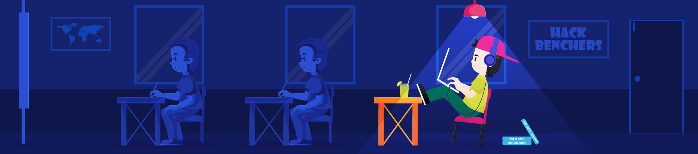

<h1 align="center">
    </h1>

    
  

  
    Bonjour à tous,   Je suis Renaud, un développeur passionné par développement web.  
    Je suis dédié à créer des solutions innovantes et à améliorer constamment mes compétences techniques. 
    Ensemble, nous pouvons transformer vos idées en projets concrets et réussis.

  

<h2 align="center">Mon Univers Techno 🌐</h2>
Mon arsenal technologique comprend : :
  

- **Python** : Mon allié pour développer des applications puissantes et robustes.
- **HTML** : La base sur laquelle reposent toutes mes créations web.
- **CSS** : L'outil qui me permet de styliser et de donner vie à mes pages.
- **JavaScript** : L'ingrédient clé pour rendre mes sites interactifs et dynamiques.
- **React** : Mon framework  pour concevoir des interfaces utilisateur modernes et réactives.
- **Node.js & Express** : Mes outils pour bâtir des backends performants et évolutifs.
- **Adobe** : Pour intégrer créativité et design dans chacun de mes projets.

#### <h2 align="center">ToolBox 🛠</h2> 

<h2 align="center">Projets  🚧</h2>

Je travaille constamment sur de nouveaux projets pour mettre en pratique mes compétences et explorer de nouvelles technologies. 

- **Application Web** : Développement d'une application full-stack pour gérer les tâches avec une interface utilisateur intuitive et un backend performant utilisant Node.js et Express.
- **Site Vitrine** : Création d'un site web responsive pour une petite entreprise, avec un design personnalisé et des animations interactives en JavaScript.
- **Outil de Visualisation de Données** : Conception d'un outil en Python pour analyser et visualiser des données complexes, facilitant ainsi la prise de décisions basée sur les données

<h2 align="center">La Météo  ☀️</h2>

<table>
    <tr>
        <th>Date</th>
        <td>13/05/2025</td><td>14/05/2025</td><td>15/05/2025</td>
    </tr>
    <tr>
        <th>Weather</th>
        <td></td><td></td><td></td>
    </tr>
    <tr>
        <th>Condition</th>
        <td width="200px">Sunny</td><td width="200px">Sunny</td><td width="200px">Sunny</td>
    </tr>
    <tr>
        <th>Temperature</th>
        <td>15.2 -  19.5 °C</td><td>15 -  19.4 °C</td><td>15.7 -  23.5 °C</td>
    </tr>
    <tr>
        <th>Wind</th>
        <td>13.3 kph</td><td>13.7 kph</td><td>25.6 kph</td>
    </tr>
</table>

<h2 align="center">Let's Connect! 🚀</h2>
Vous avez un projet en tête, envie de collaborer, ou simplement discuter de nouvelles idées ? Je serais ravi d'échanger avec vous ! N'hésitez pas à me contacter pour explorer ensemble de nouvelles opportunités et créer quelque chose. 🌟
  

 

  

  <h2>🐍 My Contributions 🐍</h2>
   
  
  
     

<h2 align="center">⚡ Stats ⚡</h2>
 

  
  
   
  

