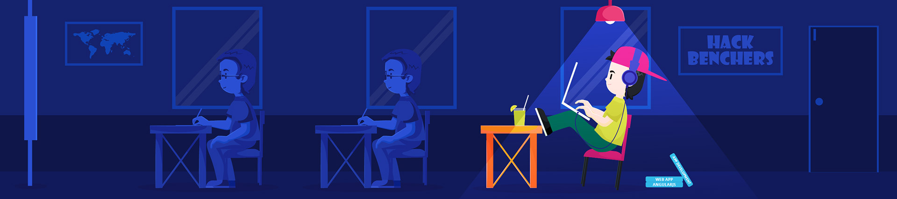
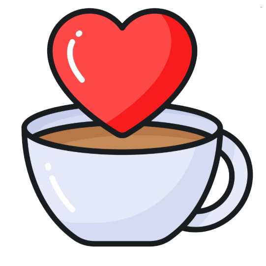
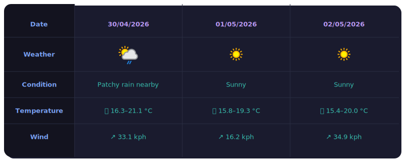
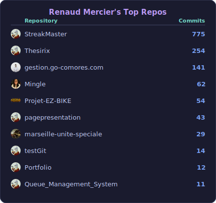
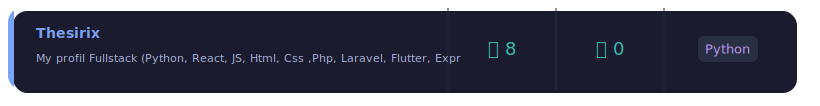
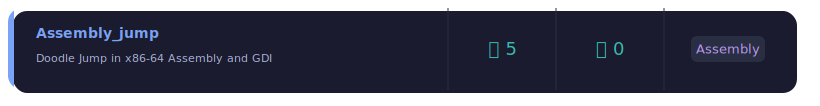
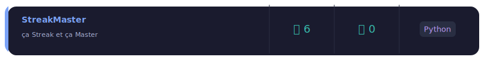

  
  &nbsp;&nbsp;
  

<h1 align="center">
  
</h1>

  
Hello everyone,  
I am Thesirix, a developer passionate about computer science. 
Beyond code, I strive to design coherent and high-performance software ecosystems. 
Together, let's turn your technical ambitions into concrete, scalable, and sustainable solutions.

  

<h2 align="center">My Tech Universe 🌐</h2>

My technological arsenal revolves around performance and mobility:
  

- 🐍 **Python** : My ally for developing powerful, robust applications and automation.
- 📱 **Flutter & Dart** : My solution for deploying native mobile applications on all screens.
- ⚛️ **JavaScript & React** : The key ingredient to make my web interfaces interactive and dynamic.
- 🐘 **PHP & Laravel** : A solid tool for structuring rigorous backends.
- 🚀 **Node.js & Express** : To build fast and scalable microservices.
- 🐳 **Docker & CI/CD** : The infrastructure for reliable and automated deployments.
- 🎨 **Adobe** : To maintain strong visual and ergonomic standards.

<h2 align="center">ToolBox 🛠</h2>

  
  
  
  
  
  
  
  
  

 

<h2 align="center">Projects 🚧</h2>

For me, code is a creative playground. I love when things run smoothly, automated, and fluid.

- 📱 **Mobile & Cloud** : Flutter apps connected to robust APIs.
- 🌐 **Fullstack Web** : React + Node.js / PHP for performant web tools.
- ⚙️ **Architecture & DevOps** : CI/CD + Docker for stable deployments.
- 📊 **Data & Tools** : Python for automation and data.

<h2 align="center">Weather Forecast ☀️</h2>

<!-- WEATHER_START -->

  

<!-- WEATHER_END -->

<h2 align="center">Let's Connect! 🚀</h2>

Do you have a technical challenge or an app idea? Let's talk.

  

  
  

 

  

<h2 align="center">⚡ Recent Activity</h2>

1. 🔨 Pushed [`19b8861`](https://github.com/Thesirix/Thesirix/commit/19b886151fb43bdfb69ccc237105377b5566f9b6) to [Thesirix/Thesirix](https://github.com/Thesirix/Thesirix) on `main` - _4h ago_
2. 🔨 Pushed [`8eb0d2b`](https://github.com/Thesirix/Thesirix/commit/8eb0d2bd7fb8eeeef4f775ddf9c987a9e5792d03) to [Thesirix/Thesirix](https://github.com/Thesirix/Thesirix) on `main` - _4h ago_
3. 🔨 Pushed [`0b77b8b`](https://github.com/Thesirix/Thesirix/commit/0b77b8be4ba527e7d5df44945a312d065461b05b) to [Thesirix/Thesirix](https://github.com/Thesirix/Thesirix) on `main` - _4h ago_
4. 🔨 Pushed [`bb89e01`](https://github.com/Thesirix/Thesirix/commit/bb89e01e3f5ddd157cd1015de9f0a53fb246d70a) to [Thesirix/Thesirix](https://github.com/Thesirix/Thesirix) on `main` - _5h ago_
5. 🔨 Pushed [`da468a3`](https://github.com/Thesirix/Thesirix/commit/da468a31eb200f6890de53ba3cfdac0a834b3072) to [Thesirix/Thesirix](https://github.com/Thesirix/Thesirix) on `main` - _5h ago_

  <h2>🐍 Snake & Contributions 🐍</h2>

  

    

  

    

  

    

  

<h2 align="center">⚡ Stats ⚡</h2>

  

  

   

  

    

  [🧙‍♂️ Cliqk here to dance](./assets/spacedance.glb)

  
  

<h2 align="center">🏆 GitHub Trophies</h2>

<h2 align="center">✍️ Random Dev Quote</h2>

<h2 align="center">📊 Profile Summary</h2>

<h2 align="center">⭐ Top Repositories</h2>

<!--TOP_REPOS_START-->

<!--TOP_REPOS_END-->

 

  
  
<i>A little beer to feed Bender and the code 🍺</i>

