<div align="right">

[](https://github.com/thesirix)
[](https://github.com/thesirix)
⠀

&nbsp;&nbsp;
<a href="https://donate.stripe.com/bJe8wPgZf71W0kz6sSfw400" target="_blank">

</a>

</div>

<h1 align="center">
  
</h1>


Hello everyone,<br><br>
I am Thesirix, a developer passionate about computer science.<br>
Beyond code, I strive to design coherent and high-performance software ecosystems.<br>
Together, let's turn your technical ambitions into concrete, scalable, and sustainable solutions.

</p>


<br><br>

<h2 align="center">My Tech Universe 🌐</h2>


My technological arsenal revolves around performance and mobility:
<br><br>

- 🐍 **Python** : My ally for developing powerful, robust applications and automation.
- 📱 **Flutter & Dart** : My solution for deploying native mobile applications on all screens.
- ⚛️ **JavaScript & React** : The key ingredient to make my web interfaces interactive and dynamic.
- 🐘 **PHP & Laravel** : A solid tool for structuring rigorous backends.
- 🚀 **Node.js & Express** : To build fast and scalable microservices.
- 🐳 **Docker & CI/CD** : The infrastructure for reliable and automated deployments.
- 🎨 **Adobe** : To maintain strong visual and ergonomic standards.

<h2 align="center">ToolBox 🛠</h2>

<div align="center">
  
  
  
  
  
  
  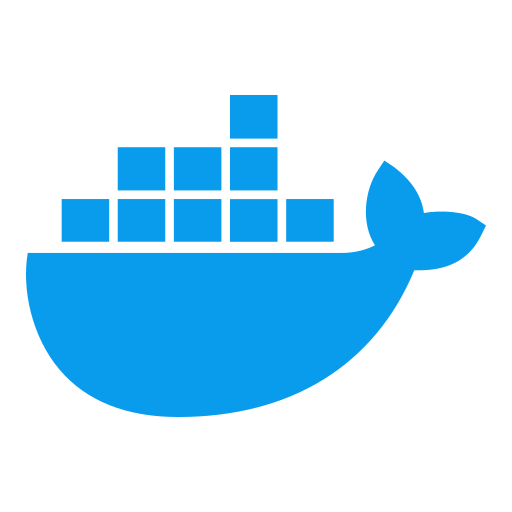
  
  
</div>

<br>
<td align="center" width="33%">
<br/>
<b>⚡ Industry Standard</b><br/>


## 🔥 Recent Activity & Achievements

<div align="center">

<table>
<tr>
<td align="center" width="50%">
    <br/>
<b>💻 Software Development</b><br/>
<sub>Building robust and scalable applications</sub><br/>
<sub>⚡ Active coding and architecture design</sub><br/>
<sub>🎯 Focus: Backend & Windows Environments</sub>
</td>
<td align="center" width="50%">
<br/>
<b>🛠️ Tool Development</b><br/>
<sub>Building custom utilities and scripts</sub><br/>
<sub>⚡ Automation for daily workflows</sub><br/>
<sub>🎯 Focus: Productivity & Developer Experience</sub>
</td>
</tr>
<tr>
<td align="center" width="50%">
<br/>
<b>📝 Documentation</b><br/>
<sub>Writing detailed project wikis & guides</sub><br/>
<sub>⚡ Technical writing & system architecture</sub><br/>
<sub>🎯 Focus: Open Source & Code Readability</sub>
</td>
<td align="center" width="50%">
<br/>
<b>📚 Continuous Learning</b><br/>
<sub>Staying updated with latest technologies</sub><br/>
<sub>⚡ Mastering new frameworks & best practices</sub><br/>
<sub>🎯 Focus: Software Craftsmanship & Innovation</sub>
</td>
</tr>
</table>

</div>

<h2 align="center">Projects 🚧</h2>

For me, code is a creative playground. I love when things run smoothly, automated, and fluid.

- 📱 **Mobile & Cloud** : Flutter apps connected to robust APIs.
- 🌐 **Fullstack Web** : React + Node.js / PHP for performant web tools.
- ⚙️ **Architecture & DevOps** : CI/CD + Docker for stable deployments.
- 📊 **Data & Tools** : Python for automation and data.

### 🤝 Open for Collaboration On:

<table>
<tr>
<td align="center" width="33%">


<b>💻 Software Engineering</b><br/>
<sub>Backend Development</sub><br/>
<sub>API Design & Integration</sub><br/>
<sub>Problem Solving</sub>

</td>
<td align="center" width="33%">
<br/>
<b>🛠️ Open Source & Tools</b><br/>
<sub>Developer Utilities</sub><br/>
<sub>Workflow Automation</sub><br/>
<sub>Community Projects</sub>
</td>
<td align="center" width="33%">
<br/>
<b>🎓 Knowledge Sharing</b><br/>
<sub>Technical Documentation</sub><br/>
<sub>Code Reviews</sub><br/>
<sub>Pair Programming</sub>
</td>
</tr>
</table>

<br/>

## 🎯 2026 Goals & Roadmap

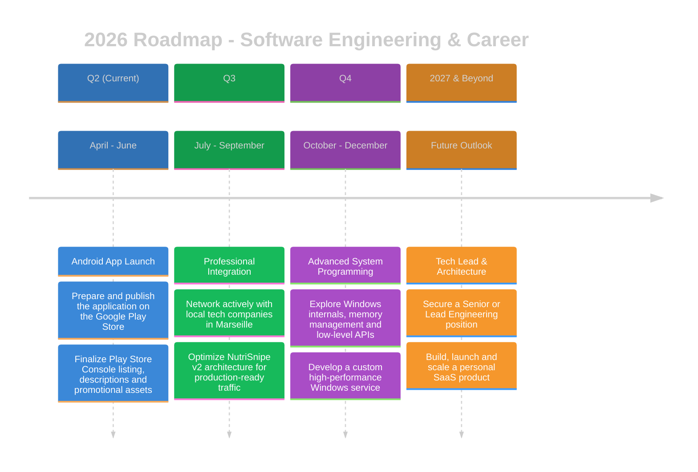
```mermaid
%%{init: { 'theme': 'dark', 'themeVariables': { 'cScale0': '#3171b4', 'cScale1': '#139b4c', 'cScale2': '#8d40a5', 'cScale3': '#cc7e25' } } }%%
timeline
    title 2026 Roadmap - Software Engineering & Career

    section Q2 (Current)
        April - June : Android App Launch : Prepare and publish the application on the Google Play Store : Finalize Play Store Console listing, descriptions and promotional assets

    section Q3
        July - September : Professional Integration : Network actively with local tech companies in Marseille : Optimize NutriSnipe v2 architecture for production-ready traffic

    section Q4
        October - December : Advanced System Programming : Explore Windows internals, memory management and low-level APIs : Develop a custom high-performance Windows service

    section 2027 & Beyond
        Future Outlook : Tech Lead & Architecture : Secure a Senior or Lead Engineering position : Build, launch and scale a personal SaaS product
```

<h2 align="center">Weather Forecast ☀️</h2>

<!-- WEATHER_START -->

<div align="center">
  
</div>

<!-- WEATHER_END -->

<h2 align="center">Let's Connect! 🚀</h2>

Do you have a technical challenge or an app idea? Let's talk.

<br><br>

<p align="center">
  <a href="https://www.linkedin.com/in/renaud-mercier/" target="blank">
    
  </a>
  <a href="https://instagram.com/art_trip_adventure" target="blank">
    
  </a>
</p>

<br>

<p align="center">
  
</p>

<h2 align="center">⚡ Recent Activity</h2>

<!-- ACTIVITY_START -->
1. 🔨 Pushed [`b81d6bb`](https://github.com/Thesirix/Thesirix/commit/b81d6bbe6b09afb9b739131af85bf897350b4fc5) to [Thesirix/Thesirix](https://github.com/Thesirix/Thesirix) on `main` - _2h ago_
2. 🔨 Pushed [`7d69828`](https://github.com/Thesirix/StreakMaster/commit/7d698286f94bb70554210c581891c5c78eb03407) to [Thesirix/StreakMaster](https://github.com/Thesirix/StreakMaster) on `main` - _10h ago_
3. 🔨 Pushed [`279ed46`](https://github.com/Thesirix/Thesirix/commit/279ed4622890761aa2e81e98a128023fc2b3d803) to [Thesirix/Thesirix](https://github.com/Thesirix/Thesirix) on `main` - _1d ago_
4. 🔨 Pushed [`10ebe2a`](https://github.com/Thesirix/StreakMaster/commit/10ebe2aaf2d4327aa32b36675c8f683f2982a037) to [Thesirix/StreakMaster](https://github.com/Thesirix/StreakMaster) on `main` - _1d ago_
5. 🔨 Pushed [`934f625`](https://github.com/Thesirix/Thesirix/commit/934f625234be6996ac62effeb5e9e2ff9f957540) to [Thesirix/Thesirix](https://github.com/Thesirix/Thesirix) on `main` - _2d ago_
<!-- ACTIVITY_END -->


## 🗣️ Languages I Speak

<div align="center">

|    Language    | Fluency Level |   Proficiency    |
| :------------: | :-----------: | :--------------: |
| fr **French**  |  ▰▰▰▰▰▰▰▰▰▰   |    **Native**    |
| 🇬🇧 **English** |  ▰▰▰▰▰▰▰▰▰▱   | **Professional** |
| es **Spanish** |  ▰▰▰▰▰▰▱▱▱▱   |   **Medium+**    |

</div>

## 🧮 Equation of the Day

<!-- EQUATION_START -->
$$
\large 2 n d \cos(\theta_2) = m \lambda
$$

Thomas Young - **Thin Film Interference (Constructive)** (1801)
> [!NOTE]
> Determines the condition for constructive interference of light waves reflecting off the upper and lower boundaries of a thin film. [Read more](https://en.wikipedia.org/wiki/Thin-film_interference)
<!-- EQUATION_END -->

<br>

## Global Software Engineering Cartography

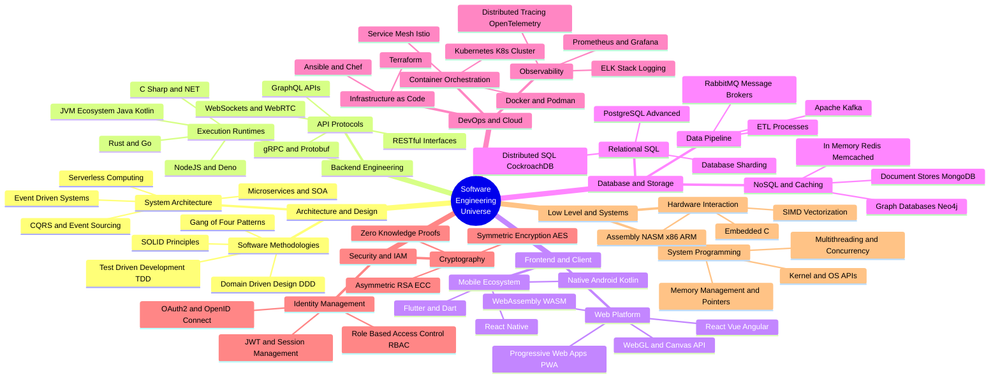
```mermaid
mindmap
  root((Software<br/>Engineering<br/>Universe))
    Architecture and Design
      System Architecture
        Microservices and SOA
        Event Driven Systems
        Serverless Computing
        CQRS and Event Sourcing
      Software Methodologies
        Domain Driven Design DDD
        Test Driven Development TDD
        SOLID Principles
        Gang of Four Patterns
    Backend Engineering
      API Protocols
        RESTful Interfaces
        GraphQL APIs
        gRPC and Protobuf
        WebSockets and WebRTC
      Execution Runtimes
        NodeJS and Deno
        Rust and Go
        JVM Ecosystem Java Kotlin
        C Sharp and NET
    Frontend and Client
      Web Platform
        React Vue Angular
        WebAssembly WASM
        Progressive Web Apps PWA
        WebGL and Canvas API
      Mobile Ecosystem
        Flutter and Dart
        React Native
        Native Android Kotlin
    Database and Storage
      Relational SQL
        PostgreSQL Advanced
        Distributed SQL CockroachDB
        Database Sharding
      NoSQL and Caching
        Document Stores MongoDB
        In Memory Redis Memcached
        Graph Databases Neo4j
      Data Pipeline
        Apache Kafka
        RabbitMQ Message Brokers
        ETL Processes
    DevOps and Cloud
      Container Orchestration
        Kubernetes K8s Cluster
        Docker and Podman
        Service Mesh Istio
      Infrastructure as Code
        Terraform
        Ansible and Chef
      Observability
        Prometheus and Grafana
        Distributed Tracing OpenTelemetry
        ELK Stack Logging
    Security and IAM
      Identity Management
        OAuth2 and OpenID Connect
        JWT and Session Management
        Role Based Access Control RBAC
      Cryptography
        Symmetric Encryption AES
        Asymmetric RSA ECC
        Zero Knowledge Proofs
    Low Level and Systems
      System Programming
        Memory Management and Pointers
        Multithreading and Concurrency
        Kernel and OS APIs
      Hardware Interaction
        Assembly NASM x86 ARM
        SIMD Vectorization
        Embedded C
```

## Git branch convention

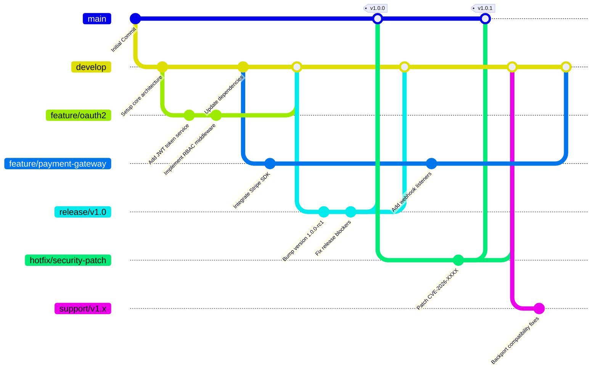
```mermaid
gitGraph
    commit id: "Initial Commit"
    branch develop
    commit id: "Setup core architecture"

    branch feature/oauth2
    commit id: "Add JWT token service"
    commit id: "Implement RBAC middleware"

    checkout develop
    commit id: "Update dependencies"

    branch feature/payment-gateway
    commit id: "Integrate Stripe SDK"

    checkout develop
    merge feature/oauth2

    branch release/v1.0
    commit id: "Bump version 1.0.0-rc1"
    commit id: "Fix release blockers"

    checkout main
    merge release/v1.0 tag: "v1.0.0"

    checkout develop
    merge release/v1.0

    checkout feature/payment-gateway
    commit id: "Add webhook listeners"

    checkout main
    branch hotfix/security-patch
    commit id: "Patch CVE-2026-XXXX"

    checkout main
    merge hotfix/security-patch tag: "v1.0.1"

    checkout develop
    merge hotfix/security-patch

    branch support/v1.x
    checkout support/v1.x
    commit id: "Backport compatibility fixes"

    checkout develop
    merge feature/payment-gateway
```

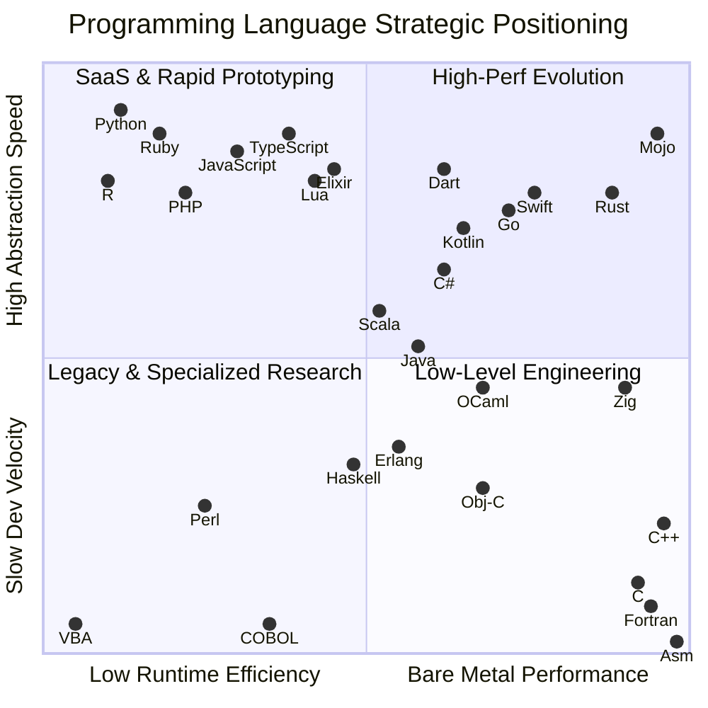
```mermaid
quadrantChart
    title Programming Language Strategic Positioning
    x-axis "Low Runtime Efficiency" --> "Bare Metal Performance"
    y-axis "Slow Dev Velocity" --> "High Abstraction Speed"

    quadrant-1 "High-Perf Evolution"
    quadrant-2 "SaaS & Rapid Prototyping"
    quadrant-3 "Legacy & Specialized Research"
    quadrant-4 "Low-Level Engineering"

    "Rust": [0.88, 0.78]
    "Go": [0.72, 0.75]
    "Mojo": [0.95, 0.88]
    "Python": [0.12, 0.92]
    "TypeScript": [0.38, 0.88]
    "JavaScript": [0.30, 0.85]
    "C++": [0.96, 0.22]
    " C ": [0.92, 0.12]
    "Asm": [0.98, 0.02]
    "Java": [0.58, 0.52]
    "Kotlin": [0.65, 0.72]
    "Swift": [0.76, 0.78]
    "Dart": [0.62, 0.82]
    "Zig": [0.90, 0.45]
    "Elixir": [0.45, 0.82]
    "Erlang": [0.55, 0.35]
    "Ruby": [0.18, 0.88]
    "PHP": [0.22, 0.78]
    "R": [0.10, 0.80]
    "Scala": [0.52, 0.58]
    "Haskell": [0.48, 0.32]
    "C#": [0.62, 0.65]
    "Fortran": [0.94, 0.08]
    "COBOL": [0.35, 0.05]
    "VBA": [0.05, 0.05]
    "Perl": [0.25, 0.25]
    "Obj-C": [0.68, 0.28]
    "Lua": [0.42, 0.80]
    "OCaml": [0.68, 0.45]
```

  <h2>🐍 Snake & Contributions 🐍</h2>

  

<br><br>

  

<br><br>

  

<br><br>


<br><br>


<br><br>


</div>

<h2 align="center">⚡ Stats ⚡</h2>

[](https://star-history.com/#thesirix/thesirix)

<div align="center">


<br><br>

  <a href="./assets/Map/map_marseille.geojson">
    
  </a>
  <p><i>🗺️ Click to explore the interactive map of Marseille</i></p>

  <a href="./assets/3D/Mini_Gandalf_print.stl">
    
  </a>
  <p><i>🧙‍♂️ Click to download & print your own Mini Gandalf in 3D</i></p>

  

</div>

<h2 align="center">🏆 GitHub Trophies</h2>

<div align="center">


</div>

<h2 align="center">✍️ Random Dev Quote</h2>

<div align="center">


</div>

<h2 align="center">📊 Profile Summary</h2>
🔝
<div align="center">

<br>

[](https://wakatime.com/@Thesirix)


<div align="center">

  

  

  <br>

  

<br><br>

<!--START_SECTION:waka-->
**I'm an Early 🐤** 

```text
🌞 Morning                1360 commits        ████████░░░░░░░░░░░░░░░░░   33.27 % 
🌆 Daytime                2167 commits        █████████████░░░░░░░░░░░░   53.01 % 
🌃 Evening                328 commits         ██░░░░░░░░░░░░░░░░░░░░░░░   08.02 % 
🌙 Night                  233 commits         █░░░░░░░░░░░░░░░░░░░░░░░░   05.70 % 
```
📅 **I'm Most Productive on Tuesday** 

```text
Monday                   710 commits         ████░░░░░░░░░░░░░░░░░░░░░   17.37 % 
Tuesday                  1004 commits        ██████░░░░░░░░░░░░░░░░░░░   24.56 % 
Wednesday                628 commits         ████░░░░░░░░░░░░░░░░░░░░░   15.36 % 
Thursday                 660 commits         ████░░░░░░░░░░░░░░░░░░░░░   16.14 % 
Friday                   371 commits         ██░░░░░░░░░░░░░░░░░░░░░░░   09.08 % 
Saturday                 235 commits         █░░░░░░░░░░░░░░░░░░░░░░░░   05.75 % 
Sunday                   480 commits         ███░░░░░░░░░░░░░░░░░░░░░░   11.74 % 
```


📊 **This Week I Spent My Time On** 

```text
🕑︎ Time Zone: Europe/Paris

💬 Programming Languages: 
JSON                     4 mins              ████████████████████████░   97.66 % 
Python                   0 secs              █░░░░░░░░░░░░░░░░░░░░░░░░   02.34 % 
```


<!--END_SECTION:waka-->


<p align="center">
  <a href="https://gitroll.io/profile/uRfPzVMN2ivbOnybp8l6yzqo9VPY2" target="_blank">
    
  </a>
</p>

</div>
<div align="center">

[](https://github.com/Jurredr/github-widgetbox)


</div>

<a href="https://app.daily.dev/thesirix"></a>


  
<h2 align="center">⭐ Top Repositories</h2>

<!--TOP_REPOS_START-->
<div align="center">


[](https://github.com/Thesirix/Thesirix)
[](https://github.com/Thesirix/StreakMaster)
[](https://github.com/Thesirix/Assembly_jump)

</div>
<!--TOP_REPOS_END-->

<h2 align="center">📊 GitHub Metrics</h2>

<div align="center">
  
</div>

<br>

<div align="center">

<a href="https://info.flagcounter.com/SVOB"></a>

</div>

<div align="center">

[](https://gitanimals.org/)

</div>

<div align="center">
  
  
  
</div>

<div align="center">


</div>

<div align="center">


</div>

<div align="center">
    
</div>

<div align="center">

<a href="https://git.io/typing-svg"></a>

</div>
<p align="center">
	<a href="" target='_blank'></a>
	<a href="" target='_blank'></a>
	<a href=""></a>
	<a href=""></a>

</p>

[:octocat:](https://github.com/axone-protocol/)

## 🚀 Example usage

Below are links to profiles where you can see Readme Typing SVGs in action!

[](https://github.com/DenverCoder1 "Jonah Lawrence on GitHub")
[](https://jini.rentalz.com/ "Jini by Rentalz.com")
[](https://github.com/warengonzaga "Waren Gonzaga on GitHub")
[](https://github.com/8BitJonny "8BitJonny on GitHub")
[](https://github.com/adityaraute "Aditya Raute on GitHub")
[](https://github.com/ShivaSankeerth "Shiva Sankeerth Reddy on GitHub")
[](https://github.com/Tarun-Kamboj "Tarun Kamboj on GitHub")
[](https://github.com/tavignesh "T.A.Vignesh on GitHub")
[](https://github.com/trumbitta "William J. Ghelfi on GitHub")
[](https://github.com/ManoBharathi93 "Mano Bharathi M on GitHub")
[](https://github.com/sudoshivam "Shivam Yadav on GitHub")
[](https://github.com/PROxZIMA "Pratik Pingale on GitHub")

<div align="center">


</div>

<div align="center">


</div>

<div align="center">

[](https://github.com/thesirix)


</div>
<a href="https://git.io/typing-svg"></a>

<details>

<summary>🧜‍♀️ Absolutely Unjustified & Over-Engineered High-Level Architecture  Mermaid Stuff </summary>

> [!CAUTION]

## Disclaimer :

> Any resemblance to a simple, functional, or sane infrastructure is purely coincidental. Proceed at your own risk.

## (Sankey) Global Cloud Infrastructure: FinOps & Data Flow Mapping

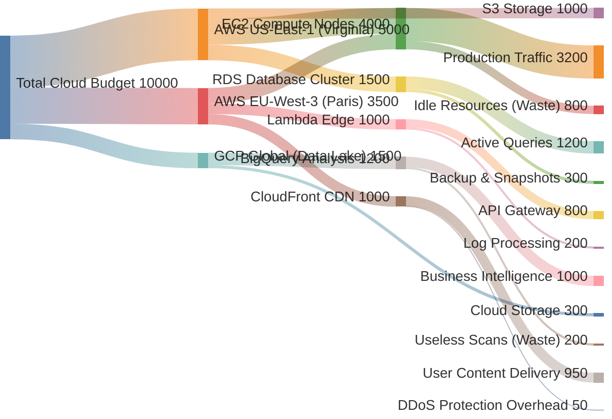
```mermaid
sankey-beta
    %% Flux du Budget Total vers les Régions
    Total Cloud Budget,AWS US-East-1 (Virginia),5000
    Total Cloud Budget,AWS EU-West-3 (Paris),3500
    Total Cloud Budget,GCP Global (Data Lake),1500

    %% Répartition Virginia (Le gros du trafic)
    AWS US-East-1 (Virginia),EC2 Compute Nodes,2500
    AWS US-East-1 (Virginia),RDS Database Cluster,1500
    AWS US-East-1 (Virginia),S3 Storage,1000

    %% Répartition Paris (Compliance & Edge)
    AWS EU-West-3 (Paris),EC2 Compute Nodes,1500
    AWS EU-West-3 (Paris),Lambda Edge,1000
    AWS EU-West-3 (Paris),CloudFront CDN,1000

    %% Le Data Lake (GCP)
    GCP Global (Data Lake),BigQuery Analysis,1200
    GCP Global (Data Lake),Cloud Storage,300

    %% Destination Finale : Valeur Métier vs Gaspillage
    EC2 Compute Nodes,Production Traffic,3200
    EC2 Compute Nodes,Idle Resources (Waste),800
    RDS Database Cluster,Active Queries,1200
    RDS Database Cluster,Backup & Snapshots,300
    Lambda Edge,API Gateway,800
    Lambda Edge,Log Processing,200
    BigQuery Analysis,Business Intelligence,1000
    BigQuery Analysis,Useless Scans (Waste),200
    CloudFront CDN,User Content Delivery,950
    CloudFront CDN,DDoS Protection Overhead,50
```

## (FlowChart) Global Enterprise Ecosystem Architecture

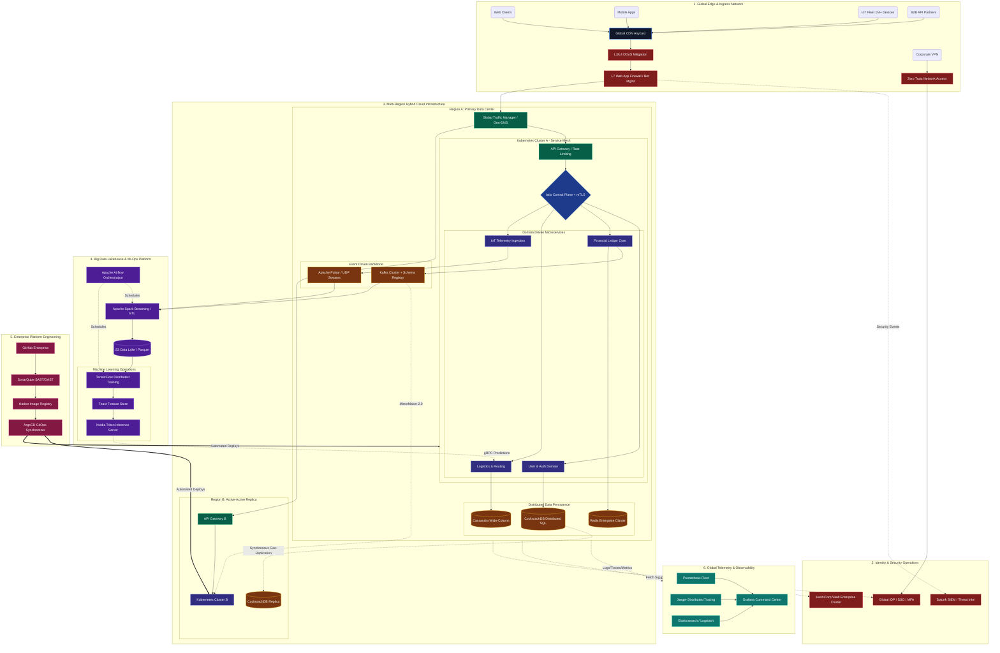
```mermaid
flowchart TD
    %% Custom Styles for visual impact
    classDef edge fill:#111827,stroke:#3b82f6,stroke-width:2px,color:#fff
    classDef gateway fill:#065f46,stroke:#34d399,color:#fff
    classDef mesh fill:#1e3a8a,stroke:#60a5fa,color:#fff
    classDef service fill:#312e81,stroke:#818cf8,color:#fff
    classDef data fill:#78350f,stroke:#fbbf24,color:#fff
    classDef ai fill:#4c1d95,stroke:#a78bfa,color:#fff
    classDef sec fill:#7f1d1d,stroke:#f87171,color:#fff
    classDef obs fill:#0f766e,stroke:#2dd4bf,color:#fff
    classDef devops fill:#831843,stroke:#f472b6,color:#fff

    %% 1. GLOBAL INGRESS & EDGE NETWORK
    subgraph GLOBAL_EDGE [1. Global Edge & Ingress Network]
        direction LR
        WEB(Web Clients)
        MOB(Mobile Apps)
        IOT(IoT Fleet 1M+ Devices)
        B2B(B2B API Partners)

        CDN[Global CDN Anycast]:::edge
        DDOS[L3/L4 DDoS Mitigation]:::sec
        WAF[L7 Web App Firewall / Bot Mgmt]:::sec
        ZTA[Zero Trust Network Access]:::sec

        WEB & MOB & IOT & B2B --> CDN --> DDOS --> WAF
        CORP_USERS(Corporate VPN) --> ZTA
    end

    %% 2. CORPORATE IDENTITY & SECURITY
    subgraph IAM_SECOPS [2. Identity & Security Operations]
        direction TB
        OKTA[Global IDP / SSO / MFA]:::sec
        SIEM[Splunk SIEM / Threat Intel]:::sec
        VAULT[HashiCorp Vault Enterprise Cluster]:::sec

        ZTA --> OKTA
        WAF -.->|Security Events| SIEM
    end

    %% 3. MULTI-REGION CLOUD PLATFORM
    subgraph MULTI_CLOUD [3. Multi-Region Hybrid Cloud Infrastructure]
        direction TB

        GTM[Global Traffic Manager / Geo-DNS]:::gateway
        WAF --> GTM

        %% REGION A - PRIMARY
        subgraph REGION_A [Region A: Primary Data Center]
            direction TB
            API_A[API Gateway / Rate Limiting]:::gateway
            GTM --> API_A

            subgraph K8S_A [Kubernetes Cluster A - Service Mesh]
                direction TB
                MESH_A{Istio Control Plane + mTLS}:::mesh

                subgraph DOMAINS [Domain Driven Microservices]
                    direction LR
                    SVC_USR[User & Auth Domain]:::service
                    SVC_FIN[Financial Ledger Core]:::service
                    SVC_LOG[Logistics & Routing]:::service
                    SVC_IOT[IoT Telemetry Ingestion]:::service
                end

                API_A --> MESH_A
                MESH_A --> SVC_USR & SVC_FIN & SVC_LOG & SVC_IOT
            end

            subgraph EVENT_BUS [Event Driven Backbone]
                direction LR
                KAFKA_A[Kafka Cluster + Schema Registry]:::data
                PULSAR[Apache Pulsar / UDP Streams]:::data
            end

            subgraph DATA_A [Distributed Data Persistence]
                direction LR
                CRDB_A[(CockroachDB Distributed SQL)]:::data
                CASS_A[(Cassandra Wide-Column)]:::data
                REDIS_A[(Redis Enterprise Cluster)]:::data
            end

            SVC_FIN --> KAFKA_A
            SVC_IOT --> PULSAR
            SVC_USR --> CRDB_A
            SVC_LOG --> CASS_A
            SVC_FIN --> REDIS_A
        end

        %% REGION B - DISASTER RECOVERY
        subgraph REGION_B [Region B: Active-Active Replica]
            direction TB
            API_B[API Gateway B]:::gateway
            GTM --> API_B
            K8S_B[Kubernetes Cluster B]:::service
            CRDB_B[(CockroachDB Replica)]:::data

            API_B --> K8S_B
            CRDB_A -.->|Synchronous Geo-Replication| CRDB_B
            KAFKA_A -.->|MirrorMaker 2.0| K8S_B
        end
    end

    %% 4. BIG DATA & AI/ML PIPELINE
    subgraph AI_LAKE [4. Big Data Lakehouse & MLOps Platform]
        direction TB
        SPARK[Apache Spark Streaming / ETL]:::ai
        HADOOP[(S3 Data Lake / Parquet)]:::ai
        AIRFLOW[Apache Airflow Orchestration]:::ai

        subgraph ML_OPS [Machine Learning Operations]
            direction LR
            TRAIN[TensorFlow Distributed Training]:::ai
            FEAT[Feast Feature Store]:::ai
            SERVE[Nvidia Triton Inference Server]:::ai
        end

        PULSAR --> SPARK
        KAFKA_A --> SPARK
        SPARK --> HADOOP
        HADOOP --> TRAIN
        TRAIN --> FEAT --> SERVE
        SERVE -.->|gRPC Predictions| SVC_LOG
        AIRFLOW -.->|Schedules| SPARK & TRAIN
    end

    %% 5. DEVOPS & CI/CD PIPELINE
    subgraph DEVOPS [5. Enterprise Platform Engineering]
        direction LR
        GIT[GitHub Enterprise]:::devops
        SONAR[SonarQube SAST/DAST]:::devops
        REG[Harbor Image Registry]:::devops
        ARGO[ArgoCD GitOps Synchronizer]:::devops

        GIT --> SONAR --> REG --> ARGO
    end

    %% 6. GLOBAL OBSERVABILITY
    subgraph OBS_PLATFORM [6. Global Telemetry & Observability]
        direction LR
        PROM[Prometheus Fleet]:::obs
        JAEG[Jaeger Distributed Tracing]:::obs
        ELAS[Elasticsearch / Logstash]:::obs
        GRAF[Grafana Command Center]:::obs

        PROM & JAEG & ELAS --> GRAF
    end

    %% CROSS-CUTTING LINKS
    REGION_A -.->|Logs/Traces/Metrics| OBS_PLATFORM
    ARGO ==>|Automated Deploys| K8S_A & K8S_B
    REGION_A -.->|Fetch Secrets| VAULT
    REGION_A -.->|OIDC Auth Requests| OKTA
```

## (erDiagram) Enterprise SaaS Relational Database Architecture

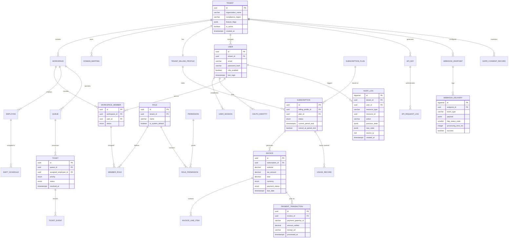
```mermaid
erDiagram
    %% CORE TENANT MANAGEMENT
    TENANT ||--o{ WORKSPACE : "contains"
    TENANT ||--o{ DOMAIN_MAPPING : "owns"
    TENANT ||--|| TENANT_BILLING_PROFILE : "has"

    %% IDENTITY AND ACCESS MANAGEMENT (IAM)
    TENANT ||--o{ USER : "manages"
    USER ||--o{ USER_SESSION : "establishes"
    USER ||--o{ OAUTH_IDENTITY : "links"
    WORKSPACE ||--o{ WORKSPACE_MEMBER : "includes"
    USER ||--o{ WORKSPACE_MEMBER : "acts as"
    WORKSPACE_MEMBER ||--o{ MEMBER_ROLE : "assigned"
    ROLE ||--o{ MEMBER_ROLE : "defines"
    ROLE ||--o{ ROLE_PERMISSION : "contains"
    PERMISSION ||--o{ ROLE_PERMISSION : "grants"

    %% BILLING AND SUBSCRIPTION
    TENANT_BILLING_PROFILE ||--o{ SUBSCRIPTION : "holds"
    SUBSCRIPTION_PLAN ||--o{ SUBSCRIPTION : "based on"
    SUBSCRIPTION ||--o{ INVOICE : "generates"
    INVOICE ||--o{ INVOICE_LINE_ITEM : "contains"
    INVOICE ||--o{ PAYMENT_TRANSACTION : "paid via"
    SUBSCRIPTION ||--o{ USAGE_RECORD : "tracks metered"

    %% INTEGRATION AND API
    TENANT ||--o{ API_KEY : "generates"
    TENANT ||--o{ WEBHOOK_ENDPOINT : "configures"
    WEBHOOK_ENDPOINT ||--o{ WEBHOOK_DELIVERY : "logs"
    API_KEY ||--o{ API_REQUEST_LOG : "authenticates"

    %% SECURITY AND AUDIT
    USER ||--o{ AUDIT_LOG : "triggers"
    TENANT ||--o{ GDPR_CONSENT_RECORD : "maintains"

    %% BUSINESS DOMAIN (QMS & ERP)
    WORKSPACE ||--o{ EMPLOYEE : "employs"
    EMPLOYEE ||--o{ SHIFT_SCHEDULE : "assigned to"
    WORKSPACE ||--o{ QUEUE : "operates"
    QUEUE ||--o{ TICKET : "processes"
    TICKET ||--o{ TICKET_EVENT : "records"

    TENANT {
        uuid id PK
        varchar organization_name
        varchar compliance_region
        jsonb feature_flags
        boolean is_active
        timestamptz created_at
    }
    USER {
        uuid id PK
        uuid tenant_id FK
        varchar email
        varchar password_hash
        boolean mfa_enabled
        timestamptz last_login
    }
    WORKSPACE_MEMBER {
        uuid id PK
        uuid workspace_id FK
        uuid user_id FK
        enum status
    }
    ROLE {
        uuid id PK
        uuid tenant_id FK
        varchar name
        boolean is_system_default
    }
    SUBSCRIPTION {
        uuid id PK
        uuid billing_profile_id FK
        uuid plan_id FK
        enum status
        timestamptz current_period_end
        boolean cancel_at_period_end
    }
    INVOICE {
        uuid id PK
        uuid subscription_id FK
        decimal subtotal
        decimal tax_amount
        decimal total
        enum currency
        enum payment_status
        timestamptz due_date
    }
    PAYMENT_TRANSACTION {
        uuid id PK
        uuid invoice_id FK
        varchar payment_gateway_id
        decimal amount_settled
        varchar receipt_url
        timestamptz processed_at
    }
    AUDIT_LOG {
        bigserial id PK
        uuid tenant_id FK
        uuid user_id FK
        varchar resource_type
        uuid resource_id
        varchar action
        jsonb previous_state
        jsonb new_state
        inet source_ip
        timestamptz created_at
    }
    WEBHOOK_DELIVERY {
        bigserial id PK
        uuid endpoint_id FK
        varchar event_type
        jsonb payload
        smallint http_status_code
        integer processing_time_ms
        boolean success
    }
    TICKET {
        uuid id PK
        uuid queue_id FK
        uuid assigned_employee_id FK
        enum priority
        enum status
        timestamptz resolved_at
    }
```

## (sequenceDiagram) Advanced Distributed Saga & Transactional Outbox Sequence

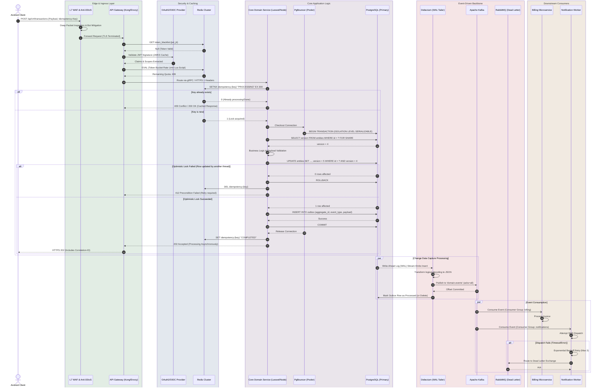
```mermaid
sequenceDiagram
    autonumber
    actor Client as Android Client

    box rgba(35, 134, 54, 0.1) Edge & Ingress Layer
        participant WAF as L7 WAF & Anti-DDoS
        participant GW as API Gateway (Kong/Envoy)
    end

    box rgba(43, 92, 143, 0.1) Security & Caching
        participant IDP as OAuth2/OIDC Provider
        participant Redis as Redis Cluster
    end

    box rgba(107, 66, 120, 0.1) Core Application Logic
        participant Svc as Core Domain Service (Laravel/Node)
        participant PGB as PgBouncer (Pooler)
        participant DB as PostgreSQL (Primary)
    end

    box rgba(215, 58, 73, 0.1) Event-Driven Backbone
        participant CDC as Debezium (WAL Tailer)
        participant Kafka as Apache Kafka
        participant DLQ as RabbitMQ (Dead Letter)
    end

    box rgba(176, 107, 26, 0.1) Downstream Consumers
        participant BillSvc as Billing Microservice
        participant NotifSvc as Notification Worker
    end

    %% Client Request Phase
    Client->>WAF: POST /api/v4/transactions (Payload, Idempotency-Key)
    WAF->>WAF: Deep Packet Inspection & Bot Mitigation
    WAF->>GW: Forward Request (TLS Terminated)

    %% Authentication & Throttling Phase
    GW->>Redis: GET token_blacklist:{jwt_jti}
    Redis-->>GW: Null (Token Valid)
    GW->>IDP: Validate JWT Signature (JWKS Cache)
    IDP-->>GW: Claims & Scopes Extracted

    GW->>Redis: EVAL (Token Bucket Rate Limit Lua Script)
    Redis-->>GW: Remaining Quota: 499

    %% Idempotency Check
    GW->>Svc: Route via gRPC / HTTPS + Headers
    Svc->>Redis: SETNX idempotency:{key} "PROCESSING" EX 300

    alt Key already exists
        Redis-->>Svc: 0 (Already processing/Done)
        Svc-->>GW: 409 Conflict / 200 OK (Cached Response)
    else Key is new
        Redis-->>Svc: 1 (Lock acquired)

        %% Database Transaction (Optimistic Locking & Outbox Pattern)
        Svc->>PGB: Checkout Connection
        PGB->>DB: BEGIN TRANSACTION (ISOLATION LEVEL SERIALIZABLE)

        Svc->>DB: SELECT version FROM entities WHERE id = ? FOR SHARE
        DB-->>Svc: version = 4

        Svc->>Svc: Business Logic & Payload Validation

        Svc->>DB: UPDATE entities SET ..., version = 5 WHERE id = ? AND version = 4
        alt Optimistic Lock Failed (Row updated by another thread)
            DB-->>Svc: 0 rows affected
            Svc->>DB: ROLLBACK
            Svc->>Redis: DEL idempotency:{key}
            Svc-->>GW: 412 Precondition Failed (Retry required)
        else Optimistic Lock Succeeded
            DB-->>Svc: 1 row affected

            %% Transactional Outbox Insert
            Svc->>DB: INSERT INTO outbox (aggregate_id, event_type, payload)
            DB-->>Svc: Success

            Svc->>DB: COMMIT
            PGB-->>Svc: Release Connection

            Svc->>Redis: SET idempotency:{key} "COMPLETED"
            Svc-->>GW: 202 Accepted (Processing Asynchronously)
            GW-->>Client: HTTPS 202 (Includes Correlation-ID)
        end
    end

    %% Asynchronous Event Streaming (CDC)
    par Change Data Capture Processing
        DB-->>CDC: Write-Ahead Log (WAL) Stream Emits Insert
        CDC->>CDC: Transform logical decoding to JSON
        CDC->>Kafka: Publish to 'domain.events' (acks=all)
        Kafka-->>CDC: Offset Committed
        CDC->>DB: Mark Outbox Row as Processed (or Delete)
    end

    %% Downstream Fan-out
    par Event Consumption
        Kafka-)BillSvc: Consume Event (Consumer Group: billing)
        BillSvc->>BillSvc: Process Invoice

        Kafka-)NotifSvc: Consume Event (Consumer Group: notifications)
        NotifSvc->>NotifSvc: Attempt SMS Dispatch

        alt Dispatch Fails (Timeout/Error)
            NotifSvc->>NotifSvc: Exponential Backoff Retry (Max 3)
            NotifSvc->>DLQ: Route to Dead Letter Exchange
            DLQ-->>NotifSvc: Ack
        end
    end
```

## (Gantt) Global Infrastructure Transformation Roadmap

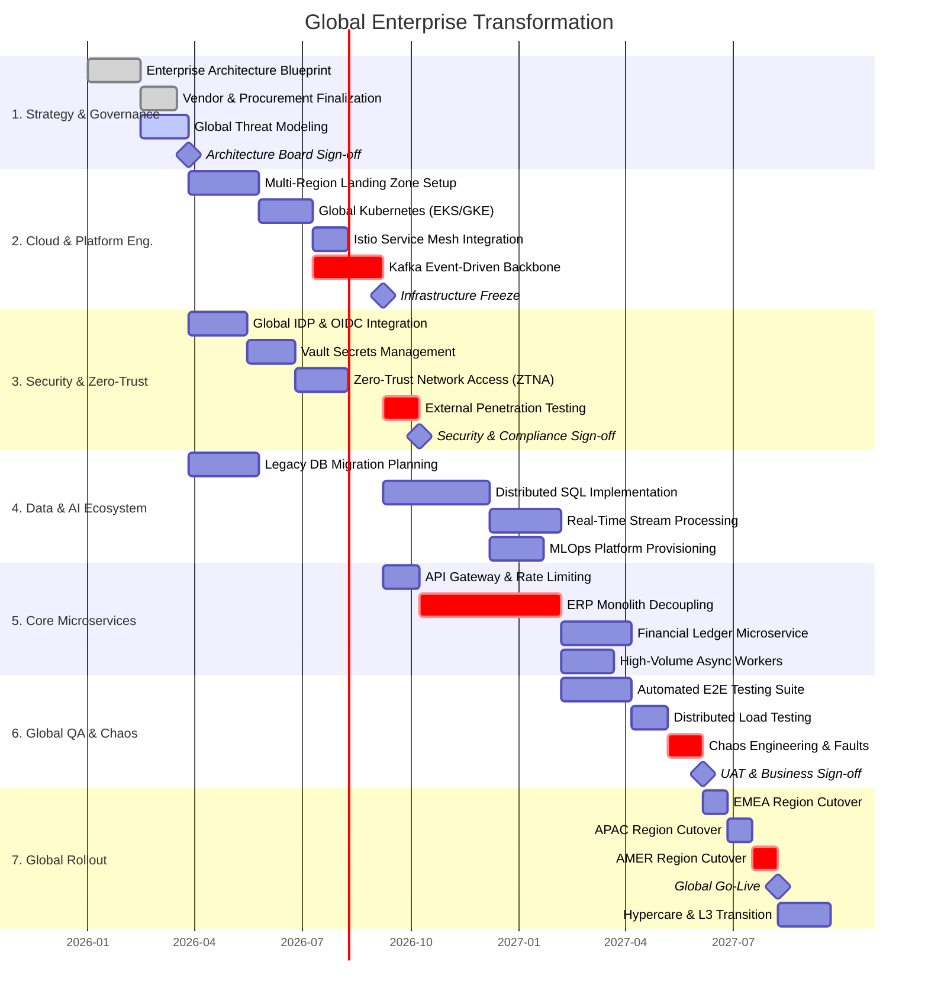
```mermaid
gantt
    title Global Enterprise Transformation
    dateFormat YYYY-MM-DD
    axisFormat %Y-%m

    section 1. Strategy & Governance
    Enterprise Architecture Blueprint :done, s1, 2026-01-01, 45d
    Vendor & Procurement Finalization :done, s2, after s1, 30d
    Global Threat Modeling            :active, s3, after s1, 40d
    Architecture Board Sign-off       :milestone, m1, after s3, 0d

    section 2. Cloud & Platform Eng.
    Multi-Region Landing Zone Setup   :c1, after m1, 60d
    Global Kubernetes (EKS/GKE)       :c2, after c1, 45d
    Istio Service Mesh Integration    :c3, after c2, 30d
    Kafka Event-Driven Backbone       :crit, c4, after c2, 60d
    Infrastructure Freeze             :milestone, m2, after c4, 0d

    section 3. Security & Zero-Trust
    Global IDP & OIDC Integration     :sec1, after m1, 50d
    Vault Secrets Management          :sec2, after sec1, 40d
    Zero-Trust Network Access (ZTNA)  :sec3, after sec2, 45d
    External Penetration Testing      :crit, sec4, after m2, 30d
    Security & Compliance Sign-off    :milestone, m3, after sec4, 0d

    section 4. Data & AI Ecosystem
    Legacy DB Migration Planning      :d1, after m1, 60d
    Distributed SQL Implementation    :d2, after m2, 90d
    Real-Time Stream Processing       :d3, after d2, 60d
    MLOps Platform Provisioning       :d4, after d2, 45d

    section 5. Core Microservices
    API Gateway & Rate Limiting       :b1, after m2, 30d
    ERP Monolith Decoupling           :crit, b2, after b1, 120d
    Financial Ledger Microservice     :b3, after b2, 60d
    High-Volume Async Workers         :b4, after b2, 45d

    section 6. Global QA & Chaos
    Automated E2E Testing Suite       :q1, after b2, 60d
    Distributed Load Testing          :q2, after q1, 30d
    Chaos Engineering & Faults        :crit, q3, after q2, 30d
    UAT & Business Sign-off           :milestone, m4, after q3, 0d

    section 7. Global Rollout
    EMEA Region Cutover               :r1, after m4, 21d
    APAC Region Cutover               :r2, after r1, 21d
    AMER Region Cutover               :crit, r3, after r2, 21d
    Global Go-Live                    :milestone, m5, after r3, 0d
    Hypercare & L3 Transition         :r4, after m5, 45d
```

## (Xychart) Enterprise Telemetry: Infrastructure Elasticity vs Traffic Surge

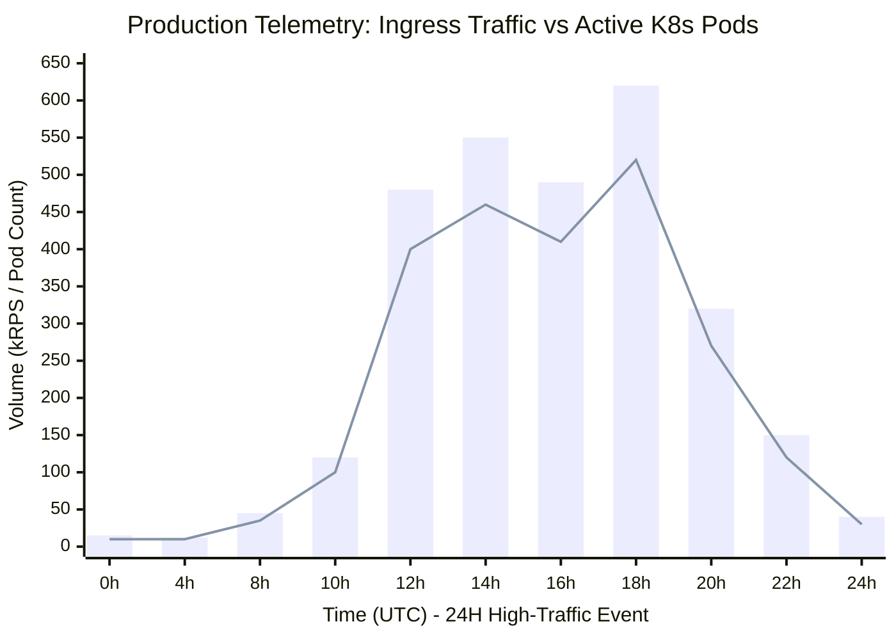
```mermaid
xychart-beta
    title "Production Telemetry: Ingress Traffic vs Active K8s Pods"
    x-axis "Time (UTC) - 24H High-Traffic Event" [0h, 4h, 8h, 10h, 12h, 14h, 16h, 18h, 20h, 22h, 24h]
    y-axis "Volume (kRPS / Pod Count)" 0 --> 650
    bar [15, 12, 45, 120, 480, 550, 490, 620, 320, 150, 40]
    line [10, 10, 35, 100, 400, 460, 410, 520, 270, 120, 30]
```

## (classDiagram) Core Financial Engine: Domain-Driven Design Architecture

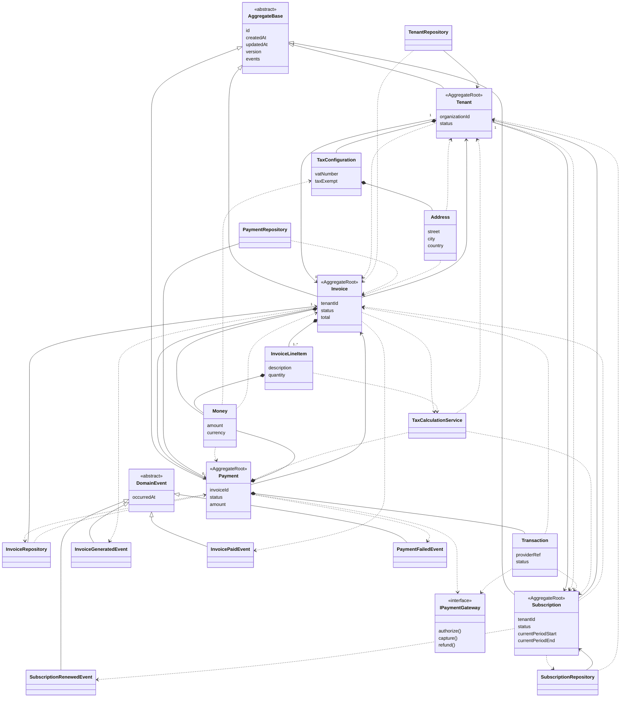
```mermaid
classDiagram
direction TB


class AggregateBase {
    <<abstract>>
    id
    createdAt
    updatedAt
    version
    events
}

class DomainEvent {
    <<abstract>>
    occurredAt
}


class Money {
    amount
    currency
}

class Address {
    street
    city
    country
}

class TaxConfiguration {
    vatNumber
    taxExempt
}


class Tenant {
    <<AggregateRoot>>
    organizationId
    status
}

class TenantRepository


class Subscription {
    <<AggregateRoot>>
    tenantId
    status
    currentPeriodStart
    currentPeriodEnd
}

class Invoice {
    <<AggregateRoot>>
    tenantId
    status
    total
}

class InvoiceLineItem {
    description
    quantity
}

class InvoiceRepository
class SubscriptionRepository


class Payment {
    <<AggregateRoot>>
    invoiceId
    status
    amount
}

class Transaction {
    providerRef
    status
}

class PaymentRepository

class IPaymentGateway {
    <<interface>>
    authorize()
    capture()
    refund()
}


class TaxCalculationService


class InvoiceGeneratedEvent
class InvoicePaidEvent
class PaymentFailedEvent
class SubscriptionRenewedEvent


AggregateBase <|-- Tenant
AggregateBase <|-- Subscription
AggregateBase <|-- Invoice
AggregateBase <|-- Payment

DomainEvent <|-- InvoiceGeneratedEvent
DomainEvent <|-- InvoicePaidEvent
DomainEvent <|-- PaymentFailedEvent
DomainEvent <|-- SubscriptionRenewedEvent


Tenant *-- TaxConfiguration
TaxConfiguration *-- Address

Invoice *-- "1..*" InvoiceLineItem
Invoice *-- Money
InvoiceLineItem *-- Money

Payment *-- Transaction
Payment *-- Money


Tenant "1" --> "0..*" Subscription
Tenant "1" --> "0..*" Invoice

Subscription --> Tenant
Invoice --> Tenant

Invoice "1" --> "0..*" Payment
Payment --> Invoice


Invoice ..> TaxCalculationService
Invoice ..> InvoiceGeneratedEvent
Invoice ..> InvoicePaidEvent

Payment ..> PaymentFailedEvent
Subscription ..> SubscriptionRenewedEvent

Payment ..> IPaymentGateway
Transaction ..> IPaymentGateway

Subscription ..> Invoice
Tenant ..> Invoice
Tenant ..> Subscription

InvoiceLineItem ..> TaxCalculationService
Payment ..> InvoiceRepository
Subscription ..> SubscriptionRepository


TenantRepository --> Tenant
InvoiceRepository --> Invoice
SubscriptionRepository --> Subscription
PaymentRepository --> Payment

TenantRepository ..> Invoice
InvoiceRepository ..> Payment
SubscriptionRepository ..> Tenant
PaymentRepository ..> Invoice


Money ..> TaxConfiguration
Money ..> Payment
Money ..> Invoice

Address ..> Tenant
Address ..> Invoice

Transaction ..> Invoice
Transaction ..> Subscription

TaxCalculationService ..> Tenant
TaxCalculationService ..> Subscription
TaxCalculationService ..> Payment
```

## (stateDiagram) Distributed Saga Orchestrator with Event-Driven Consistency & Resilience

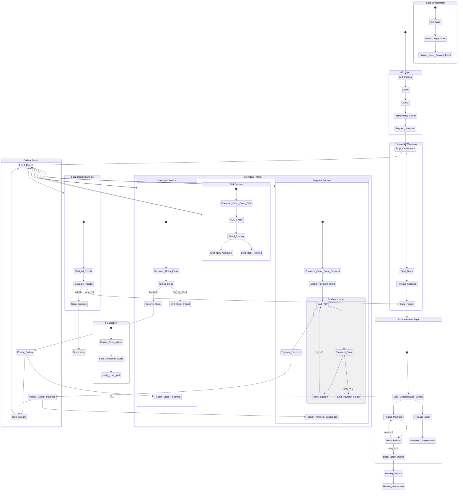
```mermaid
stateDiagram-v2
direction TB

[*] --> API_Ingress

state "API Layer" as API_Layer {
    API_Ingress --> AuthN
    AuthN --> AuthZ
    AuthZ --> Idempotency_Check
    Idempotency_Check --> Request_Accepted
}

Request_Accepted --> Saga_Orchestrator

state "Saga Orchestrator" as Saga_Orchestrator_State {
    [*] --> Init_Saga
    Init_Saga --> Persist_Saga_State
    Persist_Saga_State --> Publish_Order_Created_Event
}

Saga_Orchestrator --> Event_Bus

state "Event Bus (Kafka)" as Event_Bus_State {
    Event_Bus --> Inventory_Service
    Event_Bus --> Payment_Service
    Event_Bus --> Risk_Service
}

state "Inventory Service" as Inventory_Service {
    [*] --> Consume_Order_Event
    Consume_Order_Event --> Check_Stock
    Check_Stock --> Reserve_Stock : Available
    Check_Stock --> Emit_Stock_Failed : Out_Of_Stock

    Reserve_Stock --> Persist_Outbox
    Persist_Outbox --> Publish_Stock_Reserved
}

Inventory_Service --> Event_Bus

state "Payment Service" as Payment_Service {
    [*] --> Consume_Order_Event_Payment
    Consume_Order_Event_Payment --> Create_Payment_Intent

    Create_Payment_Intent --> Call_PSP

    state "Resilience Layer" as Resilience {
        Call_PSP --> Payment_Success
        Call_PSP --> Transient_Error
        Transient_Error --> Retry_Backoff
        Retry_Backoff --> Call_PSP : retry < 3
        Transient_Error --> Emit_Payment_Failed : retry >= 3
    }

    Payment_Success --> Persist_Outbox_Payment
    Persist_Outbox_Payment --> Publish_Payment_Succeeded
}

Payment_Service --> Event_Bus

state "Risk Service" as Risk_Service {
    [*] --> Consume_Order_Event_Risk
    Consume_Order_Event_Risk --> AML_Check
    AML_Check --> Fraud_Scoring
    Fraud_Scoring --> Emit_Risk_Approved
    Fraud_Scoring --> Emit_Risk_Rejected
}

Risk_Service --> Event_Bus

Event_Bus --> Saga_Decision

state "Saga Decision Engine" as Saga_Decision {
    [*] --> Wait_All_Events
    Wait_All_Events --> Evaluate_Results

    Evaluate_Results --> Saga_Success : All_OK
    Evaluate_Results --> Saga_Failure : Any_Fail
}

Saga_Success --> Finalization

state "Finalization" as Finalization_State {
    [*] --> Update_Read_Model
    Update_Read_Model --> Emit_Completed_Event
    Emit_Completed_Event --> Notify_User_WS
}

Finalization_State --> [*]

Saga_Failure --> Compensation_Saga

state "Compensation Saga" as Compensation_Saga {
    [*] --> Emit_Compensation_Events

    Emit_Compensation_Events --> Refund_Payment
    Emit_Compensation_Events --> Release_Stock

    Refund_Payment --> Retry_Refund
    Retry_Refund --> Refund_Payment : retry < 3
    Retry_Refund --> Dead_Letter_Queue : retry >= 3

    Release_Stock --> Inventory_Compensated
}

Compensation_Saga --> [*]

Dead_Letter_Queue --> Alerting_System
Alerting_System --> Manual_Intervention

state "Outbox Pattern" as Outbox {
    Persist_Outbox --> CDC_Stream
    Persist_Outbox_Payment --> CDC_Stream
    CDC_Stream --> Event_Bus
}

state "Timeout & Watchdog" as Timeout {
    Saga_Orchestrator --> Start_Timer
    Start_Timer --> Timeout_Reached
    Timeout_Reached --> Saga_Failure
}
```

## (Pie) Engineering Efficiency & Global Resource Drain (Industry Benchmark)

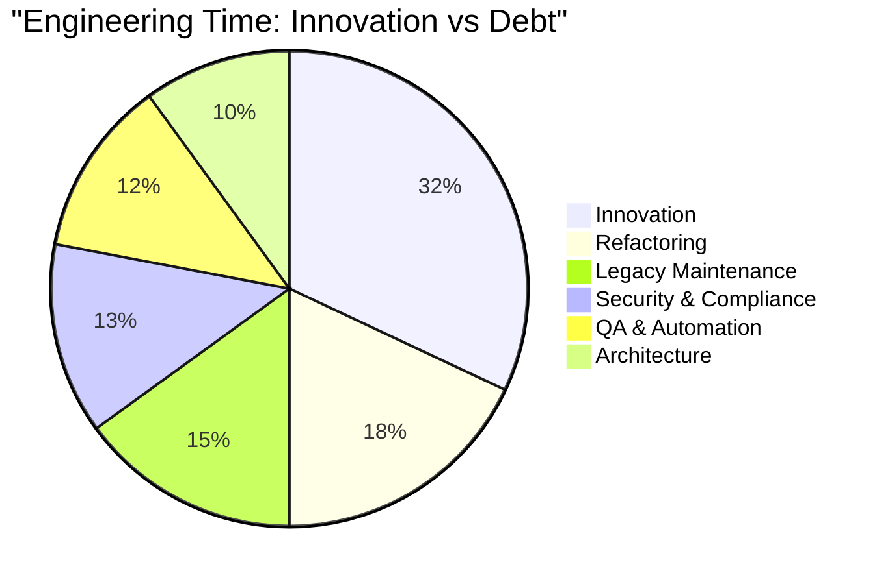
```mermaid

pie
    title "Engineering Time: Innovation vs Debt"
    "Innovation" : 32
    "Refactoring" : 18
    "Legacy Maintenance" : 15
    "Security & Compliance" : 13
    "QA & Automation" : 12
    "Architecture" : 10
```

## (Kanban) Strategic Infrastructure & Engineering Operations

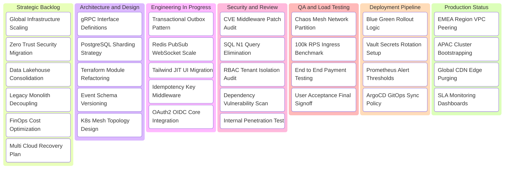
```mermaid
kanban
    Strategic Backlog
        Global Infrastructure Scaling
        Zero Trust Security Migration
        Data Lakehouse Consolidation
        Legacy Monolith Decoupling
        FinOps Cost Optimization
        Multi Cloud Recovery Plan
    Architecture and Design
        gRPC Interface Definitions
        PostgreSQL Sharding Strategy
        Terraform Module Refactoring
        Event Schema Versioning
        K8s Mesh Topology Design
    Engineering In Progress
        Transactional Outbox Pattern
        Redis PubSub WebSocket Scale
        Tailwind JIT UI Migration
        Idempotency Key Middleware
        OAuth2 OIDC Core Integration
    Security and Review
        CVE Middleware Patch Audit
        SQL N1 Query Elimination
        RBAC Tenant Isolation Audit
        Dependency Vulnerability Scan
        Internal Penetration Test
    QA and Load Testing
        Chaos Mesh Network Partition
        100k RPS Ingress Benchmark
        End to End Payment Testing
        User Acceptance Final Signoff
    Deployment Pipeline
        Blue Green Rollout Logic
        Vault Secrets Rotation Setup
        Prometheus Alert Thresholds
        ArgoCD GitOps Sync Policy
    Production Status
        EMEA Region VPC Peering
        APAC Cluster Bootstrapping
        Global CDN Edge Purging
        SLA Monitoring Dashboards
```

</details>

<br>
<div align="center">

<a href="https://github.com/Thesirix/claude-code-source-code">
  
</a>

[](https://github.com/Thesirix/EatMyTXT)

</div>

<br>

<div align="center">
  <a href="https://donate.stripe.com/bJe8wPgZf71W0kz6sSfw400" target="_blank">
    
  </a>
  <p><i>A little beer to feed Bender and the code 🍺</i></p>
</div>

<a name="pokemon"></a>

<a name="pokemon"></a>

<h2 align="center"> Real Gameboy Experience:  Play Pokémon!</h2>

<div align="center">

This is a shared game, all visitors play together. Click a button, then the page will refresh and the anchor will bring you back to see the result!

<br>
<div align="center">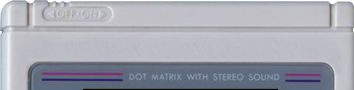<br>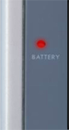<a href="https://toy.cloudreve.org/control?button=0&callback=https://github.com/Thesirix#pokemon"></a><br></div>

<div align="center">

<table border="0" cellspacing="0" cellpadding="0" frame="void" rules="none" bgcolor="#BCBDC4">

  <tr>
    <td width="57" height="53" bgcolor="#BCBDC4"></td>
    <td width="57" align="center" bgcolor="#BCBDC4"><a href="https://toy.cloudreve.org/control?button=2&callback=https://github.com/Thesirix#pokemon"></a></td>
    <td width="57" bgcolor="#BCBDC4"></td>
    <td width="49" bgcolor="#BCBDC4"></td>
    <td width="57" bgcolor="#BCBDC4"></td>
    <td width="63" align="center" bgcolor="#BCBDC4"><a href="https://toy.cloudreve.org/control?button=4&callback=https://github.com/Thesirix#pokemon"></a></td>
  </tr>
  <tr>
    <td align="center" height="53" bgcolor="#BCBDC4"><a href="https://toy.cloudreve.org/control?button=1&callback=https://github.com/Thesirix#pokemon"></a></td>
    <td align="center" bgcolor="#BCBDC4"></td>
    <td align="center" bgcolor="#BCBDC4"><a href="https://toy.cloudreve.org/control?button=0&callback=https://github.com/Thesirix#pokemon"></a></td>
    <td bgcolor="#BCBDC4"></td>
    <td align="center" bgcolor="#BCBDC4"><a href="https://toy.cloudreve.org/control?button=5&callback=https://github.com/Thesirix#pokemon"></a></td>
    <td bgcolor="#BCBDC4"></td>
  </tr>
  <tr>
    <td height="53" bgcolor="#BCBDC4"></td>
    <td align="center" bgcolor="#BCBDC4"><a href="https://toy.cloudreve.org/control?button=3&callback=https://github.com/Thesirix#pokemon">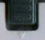</a></td>
    <td bgcolor="#BCBDC4"></td>
    <td bgcolor="#BCBDC4"></td>
    <td bgcolor="#BCBDC4"></td>
    <td bgcolor="#BCBDC4"></td>
  </tr>
  <tr>
    <td colspan="6" align="center" height="58" bgcolor="#BCBDC4">
      <a href="https://toy.cloudreve.org/control?button=6&callback=https://github.com/Thesirix#pokemon"></a>
      &nbsp;&nbsp;
      <a href="https://toy.cloudreve.org/control?button=7&callback=https://github.com/Thesirix#pokemon"></a>
    </td>
  </tr>
</table>


</div>

<!--TIMESTAMP_START-->
<div align="center">

---

🕐 **Last update:** &nbsp; `2026-06-26  19:59 (Paris)`
⏩ **Next update:** &nbsp; `2026-06-26  20:00 (Paris)`

</div>
<!--TIMESTAMP_END-->

</div>
